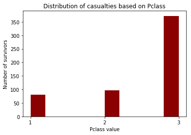

# Titanic Data Analysis

The data set which I am going to explore contains the information gathered from 891 of the 2224 passengers and crew on board the Titanic. The Data set has various columns like 
- Survival
- Pclass(Ticket class)
- Sex
- Age
- Sibsp(# of siblings / spouses aboard the Titanic)
- Parch(# of parents / children aboard the Titanic)
- Ticket(Ticket Number)
- Fare
- Cabin(cabin Number)
- Embarked (port of Embarkation).   

## Loading Data From Csv

For importing data from csv, pandas has a built in function which reads the information into a dataframe. 


```python
import pandas as pd

titanic_data = pd.read_csv('titanic_data.csv')
titanic_data.head(3)
```


<div>
<table border="1" class="dataframe">
  <thead>
    <tr style="text-align: right;">
      <th></th>
      <th>PassengerId</th>
      <th>Survived</th>
      <th>Pclass</th>
      <th>Name</th>
      <th>Sex</th>
      <th>Age</th>
      <th>SibSp</th>
      <th>Parch</th>
      <th>Ticket</th>
      <th>Fare</th>
      <th>Cabin</th>
      <th>Embarked</th>
    </tr>
  </thead>
  <tbody>
    <tr>
      <th>0</th>
      <td>1</td>
      <td>0</td>
      <td>3</td>
      <td>Braund, Mr. Owen Harris</td>
      <td>male</td>
      <td>22.0</td>
      <td>1</td>
      <td>0</td>
      <td>A/5 21171</td>
      <td>7.2500</td>
      <td>NaN</td>
      <td>S</td>
    </tr>
    <tr>
      <th>1</th>
      <td>2</td>
      <td>1</td>
      <td>1</td>
      <td>Cumings, Mrs. John Bradley (Florence Briggs Th...</td>
      <td>female</td>
      <td>38.0</td>
      <td>1</td>
      <td>0</td>
      <td>PC 17599</td>
      <td>71.2833</td>
      <td>C85</td>
      <td>C</td>
    </tr>
    <tr>
      <th>2</th>
      <td>3</td>
      <td>1</td>
      <td>3</td>
      <td>Heikkinen, Miss. Laina</td>
      <td>female</td>
      <td>26.0</td>
      <td>0</td>
      <td>0</td>
      <td>STON/O2. 3101282</td>
      <td>7.9250</td>
      <td>NaN</td>
      <td>S</td>
    </tr>
  </tbody>
</table>
</div>


## Data Cleaning

- As we see that cabin data mostly contains NaN and won't be much useful for exploration,
- And same lies with the Embarked column, this data too won't be much useful, so lets drop these columns from dataframe.


```python
del titanic_data['Cabin']
del titanic_data['Embarked']
titanic_data.head(3)
```


<div>
<table border="1" class="dataframe">
  <thead>
    <tr style="text-align: right;">
      <th></th>
      <th>PassengerId</th>
      <th>Survived</th>
      <th>Pclass</th>
      <th>Name</th>
      <th>Sex</th>
      <th>Age</th>
      <th>SibSp</th>
      <th>Parch</th>
      <th>Ticket</th>
      <th>Fare</th>
    </tr>
  </thead>
  <tbody>
    <tr>
      <th>0</th>
      <td>1</td>
      <td>0</td>
      <td>3</td>
      <td>Braund, Mr. Owen Harris</td>
      <td>male</td>
      <td>22.0</td>
      <td>1</td>
      <td>0</td>
      <td>A/5 21171</td>
      <td>7.2500</td>
    </tr>
    <tr>
      <th>1</th>
      <td>2</td>
      <td>1</td>
      <td>1</td>
      <td>Cumings, Mrs. John Bradley (Florence Briggs Th...</td>
      <td>female</td>
      <td>38.0</td>
      <td>1</td>
      <td>0</td>
      <td>PC 17599</td>
      <td>71.2833</td>
    </tr>
    <tr>
      <th>2</th>
      <td>3</td>
      <td>1</td>
      <td>3</td>
      <td>Heikkinen, Miss. Laina</td>
      <td>female</td>
      <td>26.0</td>
      <td>0</td>
      <td>0</td>
      <td>STON/O2. 3101282</td>
      <td>7.9250</td>
    </tr>
  </tbody>
</table>
</div>


## Overall Metrics

The information has a column called 'survived' whose values are either 0 or 1, using this column we can count the total number of deaths and survivors.


```python
total_no_passengers = len(titanic_data['PassengerId'])
survival_data = titanic_data['Survived']
survivied = (survival_data == 1).sum()
casualties = (survival_data == 0).sum()

print('------------------------------------------')
print('Total number of passengers on board: ',total_no_passengers)
print('Total number of survivors: ',survivied)
print('Total number of casualties: ',casualties)
print('------------------------------------------')
```

    ------------------------------------------
    Total number of passengers on board:  891
    Total number of survivors:  342
    Total number of casualties:  549
    ------------------------------------------
    

- The following pie chart shows the distribution of survivors and deaths


```python
%pylab inline
import matplotlib.pyplot as plt

def drawPieChart(labels,sizes,explode,startangle):
    plt.pie(sizes, explode=explode, labels=labels,autopct='%1.2f%%', shadow=True, startangle=startangle) 
    plt.axis('equal')
    plt.show()
    
drawPieChart(['Survivors', 'casualties'],[survivied,casualties],(0.1, 0),105)    
```

    Populating the interactive namespace from numpy and matplotlib
    


## Overall Metrics By Gender

The above metrics show the total number of survivors and casualties, now let us explore these metrics based on the gender.
Using the groupby function on dataframe based on the gender, we can count the total number of female and male survivors. when we calulate female survivors and male survivors in terms of percentages with respect to total survivors  , we find that female survivors constitute (68.13%) and male survivors constitute (31.87%). Using this information, we can conclude that females where given more preference in using life saving materials like life boats, etc.


```python
male_count = (titanic_data['Sex'] == 'male').sum()
female_count = (titanic_data['Sex'] == 'female').sum()
group_by_gender = titanic_data.groupby('Sex').sum()['Survived']
male_survivors = group_by_gender['male']
female_survivors = group_by_gender['female']
male_casualties = male_count - male_survivors
female_casualties = female_count - female_survivors

print('-------------------------------------')
print('Total number of males: ',male_count)
print('Total number of male survivors: ',male_survivors)
print('Total number of male casualties: ',male_casualties)
print('--------------------------------------')
print('Total number of females: ',female_count)
print('Total number of female survivors: ',female_survivors)
print('Total number of female casualties: ',female_casualties)
print('--------------------------------------')
```

    -------------------------------------
    Total number of males:  577
    Total number of male survivors:  109
    Total number of male casualties:  468
    --------------------------------------
    Total number of females:  314
    Total number of female survivors:  233
    Total number of female casualties:  81
    --------------------------------------
    

- The following pie chart shows the distribution of male and female survivors


```python
drawPieChart(['Female Survivors', 'Male Survivors'],[female_survivors,male_survivors],(0.1, 0),60)
```


## Explore Casualties based on Pclass

Let us exlpore the Casualties based on Pclass(A proxy for socio-economic status (SES), 1st = Upper, 2nd = Middle, 3rd = Lower) to see whether passengers were given priority based on their class. Now Lets explore some metrics related to Pclass.


```python
pclass = titanic_data['Pclass']
pclass_1 = (pclass == 1).sum()
pclass_2 = (pclass == 2).sum()
pclass_3 = (pclass == 3).sum()

pclass_1_survivors = ((pclass == 1)&(survival_data == 1)).sum()
pclass_1_casualties = ((pclass == 1)&(survival_data == 0)).sum()

pclass_2_survivors = ((pclass == 2)&(survival_data == 1)).sum()
pclass_2_casualties = ((pclass == 2)&(survival_data == 0)).sum()

pclass_3_survivors = ((pclass == 3)&(survival_data == 1)).sum()
pclass_3_casualties = ((pclass == 3)&(survival_data == 0)).sum()

print('----------------------------------')
print('Pclass 1 Metrics: ')
print('Total Number Of People: ',pclass_1)
print('Total Number Of Survivors: ',pclass_1_survivors)
print('Total Number Of casualties: ',pclass_1_casualties)
print('Survival Rate: {0}%'.format(round((pclass_1_survivors/pclass_1)*100.0,2)))
print('----------------------------------')

print('Pclass 2 Metrics: ')
print('Total Number Of People: ',pclass_2)
print('Total Number Of Survivors: ',pclass_2_survivors)
print('Total Number Of casualties: ',pclass_2_casualties)
print('Survival Rate: {0}%'.format(round((pclass_2_survivors/pclass_2)*100.0,2)))
print('----------------------------------')

print('Pclass 3 Metrics: ')
print('Total Number Of People: ',pclass_3)
print('Total Number Of Survivors: ',pclass_3_survivors)
print('Total Number Of casualties: ',pclass_3_casualties)
print('Survival Rate: {0}%'.format(round((pclass_3_survivors/pclass_3)*100.0,2)))
print('----------------------------------')
```

    ----------------------------------
    Pclass 1 Metrics: 
    Total Number Of People:  216
    Total Number Of Survivors:  136
    Total Number Of casualties:  80
    Survival Rate: 62.96%
    ----------------------------------
    Pclass 2 Metrics: 
    Total Number Of People:  184
    Total Number Of Survivors:  87
    Total Number Of casualties:  97
    Survival Rate: 47.28%
    ----------------------------------
    Pclass 3 Metrics: 
    Total Number Of People:  491
    Total Number Of Survivors:  119
    Total Number Of casualties:  372
    Survival Rate: 24.24%
    ----------------------------------
    

- From the above listed metrics, we can say that people from upper class(pclass = 1) were given priority as they had the highest survival rate of (62.96%) which is greater than the survival rates of both middle class and lower class. Lets plot a histogram of casualties to get a more precise picture


```python
pclass_casualties = pclass[survival_data == 0]

def drawHistogram(data,title,xlabel,ylabel,xticks=None,yticks=None,bins=None,color=None):
    plt.title(title)
    plt.xlabel(xlabel)
    plt.ylabel(ylabel)
    if xticks != None :
        plt.xticks(xticks)
    if yticks != None :
        plt.yticks(yticks)
    plt.hist(data,bins=bins,color=color)
    plt.show()

drawHistogram(pclass_casualties,'Distribution of casualties based on Pclass',
              'Pclass value','Number of survivors',range(1,4),color='DarkRed')
```





- The Histogram above shows the distribution of casualties based on their pclass, as we can observe that lower class has the   most number of casualties when compared to upper class and middle class. So, Now we can say that lower class people got the   least priority for life saving materials like life boats, etc. 

## Explore Survivors And Casualties Based On Age

- In this part of data exploration, I want to check whether did age played any role in survival.
- As a first step towards the Age data exploration, Lets take a look at age data for any anomalies.


```python
titanic_data[['PassengerId','Survived','Name','Sex','Age']].head(7)
```


<div>
<table border="1" class="dataframe">
  <thead>
    <tr style="text-align: right;">
      <th></th>
      <th>PassengerId</th>
      <th>Survived</th>
      <th>Name</th>
      <th>Sex</th>
      <th>Age</th>
    </tr>
  </thead>
  <tbody>
    <tr>
      <th>0</th>
      <td>1</td>
      <td>0</td>
      <td>Braund, Mr. Owen Harris</td>
      <td>male</td>
      <td>22.0</td>
    </tr>
    <tr>
      <th>1</th>
      <td>2</td>
      <td>1</td>
      <td>Cumings, Mrs. John Bradley (Florence Briggs Th...</td>
      <td>female</td>
      <td>38.0</td>
    </tr>
    <tr>
      <th>2</th>
      <td>3</td>
      <td>1</td>
      <td>Heikkinen, Miss. Laina</td>
      <td>female</td>
      <td>26.0</td>
    </tr>
    <tr>
      <th>3</th>
      <td>4</td>
      <td>1</td>
      <td>Futrelle, Mrs. Jacques Heath (Lily May Peel)</td>
      <td>female</td>
      <td>35.0</td>
    </tr>
    <tr>
      <th>4</th>
      <td>5</td>
      <td>0</td>
      <td>Allen, Mr. William Henry</td>
      <td>male</td>
      <td>35.0</td>
    </tr>
    <tr>
      <th>5</th>
      <td>6</td>
      <td>0</td>
      <td>Moran, Mr. James</td>
      <td>male</td>
      <td>NaN</td>
    </tr>
    <tr>
      <th>6</th>
      <td>7</td>
      <td>0</td>
      <td>McCarthy, Mr. Timothy J</td>
      <td>male</td>
      <td>54.0</td>
    </tr>
  </tbody>
</table>
</div>


- As we see that row number 5 contains NaN for Age column data,We need to drop all these values before taking the age data into consideration 
- Now lets take a look at some metrics for Age data.


```python
age_data = titanic_data['Age']
survived_age_data = age_data[survival_data==1].dropna()
casualties_age_data = age_data[survival_data==0].dropna()

oldest_to_survive = survived_age_data.max()
youngest_to_survive = survived_age_data.min()

oldest_to_die = casualties_age_data.max()
youngest_to_die = casualties_age_data.min()

mean_age_survivors = survived_age_data.mean()
mean_age_casualties = casualties_age_data.mean()

print('------------------------------')
print('Oldest To Survive: ',oldest_to_survive)
print('Youngest To Survive: ',youngest_to_survive)
print('------------------------------')
print('Oldest To die: ',oldest_to_die)
print('Youngest To die: ',youngest_to_die)
print('------------------------------')
print('Mean Age Of Survivors: ',round(mean_age_survivors,2))
print('Mean Age Of Casualties: ',round(mean_age_casualties,2))
print('------------------------------')
```

    ------------------------------
    Oldest To Survive:  80.0
    Youngest To Survive:  0.42
    ------------------------------
    Oldest To die:  74.0
    Youngest To die:  1.0
    ------------------------------
    Mean Age Of Survivors:  28.34
    Mean Age Of Casualties:  30.63
    ------------------------------
    

- Now lets plot the Age data of both the survivors and casualties to see whether any particular age group was given             preference. 


```python
drawHistogram(survived_age_data,'Distribution of Survivors based on Age',
              'Age value','Number of survivors',yticks=range(0,120,20),bins=8)
```


```python
drawHistogram(casualties_age_data,'Distribution of casualties based on Age',
              'Age value','Number of casualties',bins=8)
```


- When we observe distribution of age data, Even though we see a slight bump in data at age [0 - 10] of survivors when compared to the age data of casualties, We cannot say or conclude that children might have got some preference because there is not much difference between the total no of survivors and casulaties who were of age less than 10. 

- Lets explore the data of few passengers who were of age less than 10 and did not survive.


```python
child_casualties_data = titanic_data[(age_data < 10) & (survival_data == 0)]
child_casualties_data[['PassengerId','Survived','Name','Sex','Age','Ticket','Parch']].head(10)
```


<div>
<table border="1" class="dataframe">
  <thead>
    <tr style="text-align: right;">
      <th></th>
      <th>PassengerId</th>
      <th>Survived</th>
      <th>Name</th>
      <th>Sex</th>
      <th>Age</th>
      <th>Ticket</th>
      <th>Parch</th>
    </tr>
  </thead>
  <tbody>
    <tr>
      <th>7</th>
      <td>8</td>
      <td>0</td>
      <td>Palsson, Master. Gosta Leonard</td>
      <td>male</td>
      <td>2.0</td>
      <td>349909</td>
      <td>1</td>
    </tr>
    <tr>
      <th>16</th>
      <td>17</td>
      <td>0</td>
      <td>Rice, Master. Eugene</td>
      <td>male</td>
      <td>2.0</td>
      <td>382652</td>
      <td>1</td>
    </tr>
    <tr>
      <th>24</th>
      <td>25</td>
      <td>0</td>
      <td>Palsson, Miss. Torborg Danira</td>
      <td>female</td>
      <td>8.0</td>
      <td>349909</td>
      <td>1</td>
    </tr>
    <tr>
      <th>50</th>
      <td>51</td>
      <td>0</td>
      <td>Panula, Master. Juha Niilo</td>
      <td>male</td>
      <td>7.0</td>
      <td>3101295</td>
      <td>1</td>
    </tr>
    <tr>
      <th>63</th>
      <td>64</td>
      <td>0</td>
      <td>Skoog, Master. Harald</td>
      <td>male</td>
      <td>4.0</td>
      <td>347088</td>
      <td>2</td>
    </tr>
    <tr>
      <th>119</th>
      <td>120</td>
      <td>0</td>
      <td>Andersson, Miss. Ellis Anna Maria</td>
      <td>female</td>
      <td>2.0</td>
      <td>347082</td>
      <td>2</td>
    </tr>
    <tr>
      <th>147</th>
      <td>148</td>
      <td>0</td>
      <td>Ford, Miss. Robina Maggie "Ruby"</td>
      <td>female</td>
      <td>9.0</td>
      <td>W./C. 6608</td>
      <td>2</td>
    </tr>
    <tr>
      <th>164</th>
      <td>165</td>
      <td>0</td>
      <td>Panula, Master. Eino Viljami</td>
      <td>male</td>
      <td>1.0</td>
      <td>3101295</td>
      <td>1</td>
    </tr>
    <tr>
      <th>171</th>
      <td>172</td>
      <td>0</td>
      <td>Rice, Master. Arthur</td>
      <td>male</td>
      <td>4.0</td>
      <td>382652</td>
      <td>1</td>
    </tr>
    <tr>
      <th>182</th>
      <td>183</td>
      <td>0</td>
      <td>Asplund, Master. Clarence Gustaf Hugo</td>
      <td>male</td>
      <td>9.0</td>
      <td>347077</td>
      <td>2</td>
    </tr>
  </tbody>
</table>
</div>


- Based upon above data, Lets explore the data of family members of these children. To explore the family data we need to take ticket value into consideration, as people might have booked tickets under same ticket value for all their family members.


```python
ticket_data = titanic_data['Ticket']
ticket_bool = (ticket_data == '349909')|(ticket_data == '382652')|(ticket_data == '347088')|(ticket_data == '3101295')
titanic_data[(age_data > 10) &(ticket_bool) ][['PassengerId','Survived','Name','Sex','Age','Ticket','Parch']].head(10)
```


<div>
<table border="1" class="dataframe">
  <thead>
    <tr style="text-align: right;">
      <th></th>
      <th>PassengerId</th>
      <th>Survived</th>
      <th>Name</th>
      <th>Sex</th>
      <th>Age</th>
      <th>Ticket</th>
      <th>Parch</th>
    </tr>
  </thead>
  <tbody>
    <tr>
      <th>167</th>
      <td>168</td>
      <td>0</td>
      <td>Skoog, Mrs. William (Anna Bernhardina Karlsson)</td>
      <td>female</td>
      <td>45.0</td>
      <td>347088</td>
      <td>4</td>
    </tr>
    <tr>
      <th>266</th>
      <td>267</td>
      <td>0</td>
      <td>Panula, Mr. Ernesti Arvid</td>
      <td>male</td>
      <td>16.0</td>
      <td>3101295</td>
      <td>1</td>
    </tr>
    <tr>
      <th>360</th>
      <td>361</td>
      <td>0</td>
      <td>Skoog, Mr. Wilhelm</td>
      <td>male</td>
      <td>40.0</td>
      <td>347088</td>
      <td>4</td>
    </tr>
    <tr>
      <th>567</th>
      <td>568</td>
      <td>0</td>
      <td>Palsson, Mrs. Nils (Alma Cornelia Berglund)</td>
      <td>female</td>
      <td>29.0</td>
      <td>349909</td>
      <td>4</td>
    </tr>
    <tr>
      <th>638</th>
      <td>639</td>
      <td>0</td>
      <td>Panula, Mrs. Juha (Maria Emilia Ojala)</td>
      <td>female</td>
      <td>41.0</td>
      <td>3101295</td>
      <td>5</td>
    </tr>
    <tr>
      <th>686</th>
      <td>687</td>
      <td>0</td>
      <td>Panula, Mr. Jaako Arnold</td>
      <td>male</td>
      <td>14.0</td>
      <td>3101295</td>
      <td>1</td>
    </tr>
    <tr>
      <th>885</th>
      <td>886</td>
      <td>0</td>
      <td>Rice, Mrs. William (Margaret Norton)</td>
      <td>female</td>
      <td>39.0</td>
      <td>382652</td>
      <td>5</td>
    </tr>
  </tbody>
</table>
</div>


- The above data shows that none of their family members survived.
- Now lets explore the data related to children who survived and were of age less than 10.


```python
child_survivors_data = titanic_data[(age_data < 10) & (survival_data == 1)]
child_survivors_data[['PassengerId','Survived','Name','Sex','Age','Ticket','Parch']].head(10)
```


<div>
<table border="1" class="dataframe">
  <thead>
    <tr style="text-align: right;">
      <th></th>
      <th>PassengerId</th>
      <th>Survived</th>
      <th>Name</th>
      <th>Sex</th>
      <th>Age</th>
      <th>Ticket</th>
      <th>Parch</th>
    </tr>
  </thead>
  <tbody>
    <tr>
      <th>10</th>
      <td>11</td>
      <td>1</td>
      <td>Sandstrom, Miss. Marguerite Rut</td>
      <td>female</td>
      <td>4.00</td>
      <td>PP 9549</td>
      <td>1</td>
    </tr>
    <tr>
      <th>43</th>
      <td>44</td>
      <td>1</td>
      <td>Laroche, Miss. Simonne Marie Anne Andree</td>
      <td>female</td>
      <td>3.00</td>
      <td>SC/Paris 2123</td>
      <td>2</td>
    </tr>
    <tr>
      <th>58</th>
      <td>59</td>
      <td>1</td>
      <td>West, Miss. Constance Mirium</td>
      <td>female</td>
      <td>5.00</td>
      <td>C.A. 34651</td>
      <td>2</td>
    </tr>
    <tr>
      <th>78</th>
      <td>79</td>
      <td>1</td>
      <td>Caldwell, Master. Alden Gates</td>
      <td>male</td>
      <td>0.83</td>
      <td>248738</td>
      <td>2</td>
    </tr>
    <tr>
      <th>165</th>
      <td>166</td>
      <td>1</td>
      <td>Goldsmith, Master. Frank John William "Frankie"</td>
      <td>male</td>
      <td>9.00</td>
      <td>363291</td>
      <td>2</td>
    </tr>
    <tr>
      <th>172</th>
      <td>173</td>
      <td>1</td>
      <td>Johnson, Miss. Eleanor Ileen</td>
      <td>female</td>
      <td>1.00</td>
      <td>347742</td>
      <td>1</td>
    </tr>
    <tr>
      <th>183</th>
      <td>184</td>
      <td>1</td>
      <td>Becker, Master. Richard F</td>
      <td>male</td>
      <td>1.00</td>
      <td>230136</td>
      <td>1</td>
    </tr>
    <tr>
      <th>184</th>
      <td>185</td>
      <td>1</td>
      <td>Kink-Heilmann, Miss. Luise Gretchen</td>
      <td>female</td>
      <td>4.00</td>
      <td>315153</td>
      <td>2</td>
    </tr>
    <tr>
      <th>193</th>
      <td>194</td>
      <td>1</td>
      <td>Navratil, Master. Michel M</td>
      <td>male</td>
      <td>3.00</td>
      <td>230080</td>
      <td>1</td>
    </tr>
    <tr>
      <th>233</th>
      <td>234</td>
      <td>1</td>
      <td>Asplund, Miss. Lillian Gertrud</td>
      <td>female</td>
      <td>5.00</td>
      <td>347077</td>
      <td>2</td>
    </tr>
  </tbody>
</table>
</div>


- Now lets explore the data of fmaily members related to these children.


```python
ticket_bool = ((ticket_data == '248738')|(ticket_data == 'SC/Paris 2123')|(ticket_data == '363291')|(ticket_data == '347077')
               |(ticket_data == 'C.A. 34651')|(ticket_data == 'F.C.C. 13529'))
data = titanic_data[(age_data > 10)&(ticket_bool)][['PassengerId','Survived','Name','Sex','Age','Ticket','Parch']]

def highlight_max(s):
    '''
    To Highlight male rows in data
    '''
    is_max = s == 'male'
    if is_max['Sex'] :
        is_max = is_max | True  
         
    return ['background-color: #ff9999' if v else 'background-color: #80ffcc' for v in is_max]

data.style.apply(highlight_max,axis=1)
```


        <style  type="text/css" >
        
        
            #T_19eb3876_1643_11e7_b07f_685d43992905row0_col0 {
            
                background-color:  #80ffcc;
            
            }
        
            #T_19eb3876_1643_11e7_b07f_685d43992905row0_col1 {
            
                background-color:  #80ffcc;
            
            }
        
            #T_19eb3876_1643_11e7_b07f_685d43992905row0_col2 {
            
                background-color:  #80ffcc;
            
            }
        
            #T_19eb3876_1643_11e7_b07f_685d43992905row0_col3 {
            
                background-color:  #80ffcc;
            
            }
        
            #T_19eb3876_1643_11e7_b07f_685d43992905row0_col4 {
            
                background-color:  #80ffcc;
            
            }
        
            #T_19eb3876_1643_11e7_b07f_685d43992905row0_col5 {
            
                background-color:  #80ffcc;
            
            }
        
            #T_19eb3876_1643_11e7_b07f_685d43992905row0_col6 {
            
                background-color:  #80ffcc;
            
            }
        
            #T_19eb3876_1643_11e7_b07f_685d43992905row1_col0 {
            
                background-color:  #ff9999;
            
            }
        
            #T_19eb3876_1643_11e7_b07f_685d43992905row1_col1 {
            
                background-color:  #ff9999;
            
            }
        
            #T_19eb3876_1643_11e7_b07f_685d43992905row1_col2 {
            
                background-color:  #ff9999;
            
            }
        
            #T_19eb3876_1643_11e7_b07f_685d43992905row1_col3 {
            
                background-color:  #ff9999;
            
            }
        
            #T_19eb3876_1643_11e7_b07f_685d43992905row1_col4 {
            
                background-color:  #ff9999;
            
            }
        
            #T_19eb3876_1643_11e7_b07f_685d43992905row1_col5 {
            
                background-color:  #ff9999;
            
            }
        
            #T_19eb3876_1643_11e7_b07f_685d43992905row1_col6 {
            
                background-color:  #ff9999;
            
            }
        
            #T_19eb3876_1643_11e7_b07f_685d43992905row2_col0 {
            
                background-color:  #80ffcc;
            
            }
        
            #T_19eb3876_1643_11e7_b07f_685d43992905row2_col1 {
            
                background-color:  #80ffcc;
            
            }
        
            #T_19eb3876_1643_11e7_b07f_685d43992905row2_col2 {
            
                background-color:  #80ffcc;
            
            }
        
            #T_19eb3876_1643_11e7_b07f_685d43992905row2_col3 {
            
                background-color:  #80ffcc;
            
            }
        
            #T_19eb3876_1643_11e7_b07f_685d43992905row2_col4 {
            
                background-color:  #80ffcc;
            
            }
        
            #T_19eb3876_1643_11e7_b07f_685d43992905row2_col5 {
            
                background-color:  #80ffcc;
            
            }
        
            #T_19eb3876_1643_11e7_b07f_685d43992905row2_col6 {
            
                background-color:  #80ffcc;
            
            }
        
            #T_19eb3876_1643_11e7_b07f_685d43992905row3_col0 {
            
                background-color:  #80ffcc;
            
            }
        
            #T_19eb3876_1643_11e7_b07f_685d43992905row3_col1 {
            
                background-color:  #80ffcc;
            
            }
        
            #T_19eb3876_1643_11e7_b07f_685d43992905row3_col2 {
            
                background-color:  #80ffcc;
            
            }
        
            #T_19eb3876_1643_11e7_b07f_685d43992905row3_col3 {
            
                background-color:  #80ffcc;
            
            }
        
            #T_19eb3876_1643_11e7_b07f_685d43992905row3_col4 {
            
                background-color:  #80ffcc;
            
            }
        
            #T_19eb3876_1643_11e7_b07f_685d43992905row3_col5 {
            
                background-color:  #80ffcc;
            
            }
        
            #T_19eb3876_1643_11e7_b07f_685d43992905row3_col6 {
            
                background-color:  #80ffcc;
            
            }
        
            #T_19eb3876_1643_11e7_b07f_685d43992905row4_col0 {
            
                background-color:  #80ffcc;
            
            }
        
            #T_19eb3876_1643_11e7_b07f_685d43992905row4_col1 {
            
                background-color:  #80ffcc;
            
            }
        
            #T_19eb3876_1643_11e7_b07f_685d43992905row4_col2 {
            
                background-color:  #80ffcc;
            
            }
        
            #T_19eb3876_1643_11e7_b07f_685d43992905row4_col3 {
            
                background-color:  #80ffcc;
            
            }
        
            #T_19eb3876_1643_11e7_b07f_685d43992905row4_col4 {
            
                background-color:  #80ffcc;
            
            }
        
            #T_19eb3876_1643_11e7_b07f_685d43992905row4_col5 {
            
                background-color:  #80ffcc;
            
            }
        
            #T_19eb3876_1643_11e7_b07f_685d43992905row4_col6 {
            
                background-color:  #80ffcc;
            
            }
        
            #T_19eb3876_1643_11e7_b07f_685d43992905row5_col0 {
            
                background-color:  #ff9999;
            
            }
        
            #T_19eb3876_1643_11e7_b07f_685d43992905row5_col1 {
            
                background-color:  #ff9999;
            
            }
        
            #T_19eb3876_1643_11e7_b07f_685d43992905row5_col2 {
            
                background-color:  #ff9999;
            
            }
        
            #T_19eb3876_1643_11e7_b07f_685d43992905row5_col3 {
            
                background-color:  #ff9999;
            
            }
        
            #T_19eb3876_1643_11e7_b07f_685d43992905row5_col4 {
            
                background-color:  #ff9999;
            
            }
        
            #T_19eb3876_1643_11e7_b07f_685d43992905row5_col5 {
            
                background-color:  #ff9999;
            
            }
        
            #T_19eb3876_1643_11e7_b07f_685d43992905row5_col6 {
            
                background-color:  #ff9999;
            
            }
        
            #T_19eb3876_1643_11e7_b07f_685d43992905row6_col0 {
            
                background-color:  #80ffcc;
            
            }
        
            #T_19eb3876_1643_11e7_b07f_685d43992905row6_col1 {
            
                background-color:  #80ffcc;
            
            }
        
            #T_19eb3876_1643_11e7_b07f_685d43992905row6_col2 {
            
                background-color:  #80ffcc;
            
            }
        
            #T_19eb3876_1643_11e7_b07f_685d43992905row6_col3 {
            
                background-color:  #80ffcc;
            
            }
        
            #T_19eb3876_1643_11e7_b07f_685d43992905row6_col4 {
            
                background-color:  #80ffcc;
            
            }
        
            #T_19eb3876_1643_11e7_b07f_685d43992905row6_col5 {
            
                background-color:  #80ffcc;
            
            }
        
            #T_19eb3876_1643_11e7_b07f_685d43992905row6_col6 {
            
                background-color:  #80ffcc;
            
            }
        
            #T_19eb3876_1643_11e7_b07f_685d43992905row7_col0 {
            
                background-color:  #ff9999;
            
            }
        
            #T_19eb3876_1643_11e7_b07f_685d43992905row7_col1 {
            
                background-color:  #ff9999;
            
            }
        
            #T_19eb3876_1643_11e7_b07f_685d43992905row7_col2 {
            
                background-color:  #ff9999;
            
            }
        
            #T_19eb3876_1643_11e7_b07f_685d43992905row7_col3 {
            
                background-color:  #ff9999;
            
            }
        
            #T_19eb3876_1643_11e7_b07f_685d43992905row7_col4 {
            
                background-color:  #ff9999;
            
            }
        
            #T_19eb3876_1643_11e7_b07f_685d43992905row7_col5 {
            
                background-color:  #ff9999;
            
            }
        
            #T_19eb3876_1643_11e7_b07f_685d43992905row7_col6 {
            
                background-color:  #ff9999;
            
            }
        
            #T_19eb3876_1643_11e7_b07f_685d43992905row8_col0 {
            
                background-color:  #80ffcc;
            
            }
        
            #T_19eb3876_1643_11e7_b07f_685d43992905row8_col1 {
            
                background-color:  #80ffcc;
            
            }
        
            #T_19eb3876_1643_11e7_b07f_685d43992905row8_col2 {
            
                background-color:  #80ffcc;
            
            }
        
            #T_19eb3876_1643_11e7_b07f_685d43992905row8_col3 {
            
                background-color:  #80ffcc;
            
            }
        
            #T_19eb3876_1643_11e7_b07f_685d43992905row8_col4 {
            
                background-color:  #80ffcc;
            
            }
        
            #T_19eb3876_1643_11e7_b07f_685d43992905row8_col5 {
            
                background-color:  #80ffcc;
            
            }
        
            #T_19eb3876_1643_11e7_b07f_685d43992905row8_col6 {
            
                background-color:  #80ffcc;
            
            }
        
            #T_19eb3876_1643_11e7_b07f_685d43992905row9_col0 {
            
                background-color:  #ff9999;
            
            }
        
            #T_19eb3876_1643_11e7_b07f_685d43992905row9_col1 {
            
                background-color:  #ff9999;
            
            }
        
            #T_19eb3876_1643_11e7_b07f_685d43992905row9_col2 {
            
                background-color:  #ff9999;
            
            }
        
            #T_19eb3876_1643_11e7_b07f_685d43992905row9_col3 {
            
                background-color:  #ff9999;
            
            }
        
            #T_19eb3876_1643_11e7_b07f_685d43992905row9_col4 {
            
                background-color:  #ff9999;
            
            }
        
            #T_19eb3876_1643_11e7_b07f_685d43992905row9_col5 {
            
                background-color:  #ff9999;
            
            }
        
            #T_19eb3876_1643_11e7_b07f_685d43992905row9_col6 {
            
                background-color:  #ff9999;
            
            }
        
        </style>

        <table id="T_19eb3876_1643_11e7_b07f_685d43992905" None>
        

        <thead>
            
            <tr>
                
                
                <th class="blank level0" >
                  
                
                
                
                <th class="col_heading level0 col0" colspan=1>
                  PassengerId
                
                
                
                <th class="col_heading level0 col1" colspan=1>
                  Survived
                
                
                
                <th class="col_heading level0 col2" colspan=1>
                  Name
                
                
                
                <th class="col_heading level0 col3" colspan=1>
                  Sex
                
                
                
                <th class="col_heading level0 col4" colspan=1>
                  Age
                
                
                
                <th class="col_heading level0 col5" colspan=1>
                  Ticket
                
                
                
                <th class="col_heading level0 col6" colspan=1>
                  Parch
                
                
            </tr>
            
        </thead>
        <tbody>
            
            <tr>
                
                
                <th id="T_19eb3876_1643_11e7_b07f_685d43992905"
                 class="row_heading level0 row0" rowspan=1>
                    25
                
                
                
                <td id="T_19eb3876_1643_11e7_b07f_685d43992905row0_col0"
                 class="data row0 col0" >
                    26
                
                
                
                <td id="T_19eb3876_1643_11e7_b07f_685d43992905row0_col1"
                 class="data row0 col1" >
                    1
                
                
                
                <td id="T_19eb3876_1643_11e7_b07f_685d43992905row0_col2"
                 class="data row0 col2" >
                    Asplund, Mrs. Carl Oscar (Selma Augusta Emilia Johansson)
                
                
                
                <td id="T_19eb3876_1643_11e7_b07f_685d43992905row0_col3"
                 class="data row0 col3" >
                    female
                
                
                
                <td id="T_19eb3876_1643_11e7_b07f_685d43992905row0_col4"
                 class="data row0 col4" >
                    38
                
                
                
                <td id="T_19eb3876_1643_11e7_b07f_685d43992905row0_col5"
                 class="data row0 col5" >
                    347077
                
                
                
                <td id="T_19eb3876_1643_11e7_b07f_685d43992905row0_col6"
                 class="data row0 col6" >
                    5
                
                
            </tr>
            
            <tr>
                
                
                <th id="T_19eb3876_1643_11e7_b07f_685d43992905"
                 class="row_heading level0 row1" rowspan=1>
                    314
                
                
                
                <td id="T_19eb3876_1643_11e7_b07f_685d43992905row1_col0"
                 class="data row1 col0" >
                    315
                
                
                
                <td id="T_19eb3876_1643_11e7_b07f_685d43992905row1_col1"
                 class="data row1 col1" >
                    0
                
                
                
                <td id="T_19eb3876_1643_11e7_b07f_685d43992905row1_col2"
                 class="data row1 col2" >
                    Hart, Mr. Benjamin
                
                
                
                <td id="T_19eb3876_1643_11e7_b07f_685d43992905row1_col3"
                 class="data row1 col3" >
                    male
                
                
                
                <td id="T_19eb3876_1643_11e7_b07f_685d43992905row1_col4"
                 class="data row1 col4" >
                    43
                
                
                
                <td id="T_19eb3876_1643_11e7_b07f_685d43992905row1_col5"
                 class="data row1 col5" >
                    F.C.C. 13529
                
                
                
                <td id="T_19eb3876_1643_11e7_b07f_685d43992905row1_col6"
                 class="data row1 col6" >
                    1
                
                
            </tr>
            
            <tr>
                
                
                <th id="T_19eb3876_1643_11e7_b07f_685d43992905"
                 class="row_heading level0 row2" rowspan=1>
                    323
                
                
                
                <td id="T_19eb3876_1643_11e7_b07f_685d43992905row2_col0"
                 class="data row2 col0" >
                    324
                
                
                
                <td id="T_19eb3876_1643_11e7_b07f_685d43992905row2_col1"
                 class="data row2 col1" >
                    1
                
                
                
                <td id="T_19eb3876_1643_11e7_b07f_685d43992905row2_col2"
                 class="data row2 col2" >
                    Caldwell, Mrs. Albert Francis (Sylvia Mae Harbaugh)
                
                
                
                <td id="T_19eb3876_1643_11e7_b07f_685d43992905row2_col3"
                 class="data row2 col3" >
                    female
                
                
                
                <td id="T_19eb3876_1643_11e7_b07f_685d43992905row2_col4"
                 class="data row2 col4" >
                    22
                
                
                
                <td id="T_19eb3876_1643_11e7_b07f_685d43992905row2_col5"
                 class="data row2 col5" >
                    248738
                
                
                
                <td id="T_19eb3876_1643_11e7_b07f_685d43992905row2_col6"
                 class="data row2 col6" >
                    1
                
                
            </tr>
            
            <tr>
                
                
                <th id="T_19eb3876_1643_11e7_b07f_685d43992905"
                 class="row_heading level0 row3" rowspan=1>
                    328
                
                
                
                <td id="T_19eb3876_1643_11e7_b07f_685d43992905row3_col0"
                 class="data row3 col0" >
                    329
                
                
                
                <td id="T_19eb3876_1643_11e7_b07f_685d43992905row3_col1"
                 class="data row3 col1" >
                    1
                
                
                
                <td id="T_19eb3876_1643_11e7_b07f_685d43992905row3_col2"
                 class="data row3 col2" >
                    Goldsmith, Mrs. Frank John (Emily Alice Brown)
                
                
                
                <td id="T_19eb3876_1643_11e7_b07f_685d43992905row3_col3"
                 class="data row3 col3" >
                    female
                
                
                
                <td id="T_19eb3876_1643_11e7_b07f_685d43992905row3_col4"
                 class="data row3 col4" >
                    31
                
                
                
                <td id="T_19eb3876_1643_11e7_b07f_685d43992905row3_col5"
                 class="data row3 col5" >
                    363291
                
                
                
                <td id="T_19eb3876_1643_11e7_b07f_685d43992905row3_col6"
                 class="data row3 col6" >
                    1
                
                
            </tr>
            
            <tr>
                
                
                <th id="T_19eb3876_1643_11e7_b07f_685d43992905"
                 class="row_heading level0 row4" rowspan=1>
                    440
                
                
                
                <td id="T_19eb3876_1643_11e7_b07f_685d43992905row4_col0"
                 class="data row4 col0" >
                    441
                
                
                
                <td id="T_19eb3876_1643_11e7_b07f_685d43992905row4_col1"
                 class="data row4 col1" >
                    1
                
                
                
                <td id="T_19eb3876_1643_11e7_b07f_685d43992905row4_col2"
                 class="data row4 col2" >
                    Hart, Mrs. Benjamin (Esther Ada Bloomfield)
                
                
                
                <td id="T_19eb3876_1643_11e7_b07f_685d43992905row4_col3"
                 class="data row4 col3" >
                    female
                
                
                
                <td id="T_19eb3876_1643_11e7_b07f_685d43992905row4_col4"
                 class="data row4 col4" >
                    45
                
                
                
                <td id="T_19eb3876_1643_11e7_b07f_685d43992905row4_col5"
                 class="data row4 col5" >
                    F.C.C. 13529
                
                
                
                <td id="T_19eb3876_1643_11e7_b07f_685d43992905row4_col6"
                 class="data row4 col6" >
                    1
                
                
            </tr>
            
            <tr>
                
                
                <th id="T_19eb3876_1643_11e7_b07f_685d43992905"
                 class="row_heading level0 row5" rowspan=1>
                    450
                
                
                
                <td id="T_19eb3876_1643_11e7_b07f_685d43992905row5_col0"
                 class="data row5 col0" >
                    451
                
                
                
                <td id="T_19eb3876_1643_11e7_b07f_685d43992905row5_col1"
                 class="data row5 col1" >
                    0
                
                
                
                <td id="T_19eb3876_1643_11e7_b07f_685d43992905row5_col2"
                 class="data row5 col2" >
                    West, Mr. Edwy Arthur
                
                
                
                <td id="T_19eb3876_1643_11e7_b07f_685d43992905row5_col3"
                 class="data row5 col3" >
                    male
                
                
                
                <td id="T_19eb3876_1643_11e7_b07f_685d43992905row5_col4"
                 class="data row5 col4" >
                    36
                
                
                
                <td id="T_19eb3876_1643_11e7_b07f_685d43992905row5_col5"
                 class="data row5 col5" >
                    C.A. 34651
                
                
                
                <td id="T_19eb3876_1643_11e7_b07f_685d43992905row5_col6"
                 class="data row5 col6" >
                    2
                
                
            </tr>
            
            <tr>
                
                
                <th id="T_19eb3876_1643_11e7_b07f_685d43992905"
                 class="row_heading level0 row6" rowspan=1>
                    472
                
                
                
                <td id="T_19eb3876_1643_11e7_b07f_685d43992905row6_col0"
                 class="data row6 col0" >
                    473
                
                
                
                <td id="T_19eb3876_1643_11e7_b07f_685d43992905row6_col1"
                 class="data row6 col1" >
                    1
                
                
                
                <td id="T_19eb3876_1643_11e7_b07f_685d43992905row6_col2"
                 class="data row6 col2" >
                    West, Mrs. Edwy Arthur (Ada Mary Worth)
                
                
                
                <td id="T_19eb3876_1643_11e7_b07f_685d43992905row6_col3"
                 class="data row6 col3" >
                    female
                
                
                
                <td id="T_19eb3876_1643_11e7_b07f_685d43992905row6_col4"
                 class="data row6 col4" >
                    33
                
                
                
                <td id="T_19eb3876_1643_11e7_b07f_685d43992905row6_col5"
                 class="data row6 col5" >
                    C.A. 34651
                
                
                
                <td id="T_19eb3876_1643_11e7_b07f_685d43992905row6_col6"
                 class="data row6 col6" >
                    2
                
                
            </tr>
            
            <tr>
                
                
                <th id="T_19eb3876_1643_11e7_b07f_685d43992905"
                 class="row_heading level0 row7" rowspan=1>
                    548
                
                
                
                <td id="T_19eb3876_1643_11e7_b07f_685d43992905row7_col0"
                 class="data row7 col0" >
                    549
                
                
                
                <td id="T_19eb3876_1643_11e7_b07f_685d43992905row7_col1"
                 class="data row7 col1" >
                    0
                
                
                
                <td id="T_19eb3876_1643_11e7_b07f_685d43992905row7_col2"
                 class="data row7 col2" >
                    Goldsmith, Mr. Frank John
                
                
                
                <td id="T_19eb3876_1643_11e7_b07f_685d43992905row7_col3"
                 class="data row7 col3" >
                    male
                
                
                
                <td id="T_19eb3876_1643_11e7_b07f_685d43992905row7_col4"
                 class="data row7 col4" >
                    33
                
                
                
                <td id="T_19eb3876_1643_11e7_b07f_685d43992905row7_col5"
                 class="data row7 col5" >
                    363291
                
                
                
                <td id="T_19eb3876_1643_11e7_b07f_685d43992905row7_col6"
                 class="data row7 col6" >
                    1
                
                
            </tr>
            
            <tr>
                
                
                <th id="T_19eb3876_1643_11e7_b07f_685d43992905"
                 class="row_heading level0 row8" rowspan=1>
                    608
                
                
                
                <td id="T_19eb3876_1643_11e7_b07f_685d43992905row8_col0"
                 class="data row8 col0" >
                    609
                
                
                
                <td id="T_19eb3876_1643_11e7_b07f_685d43992905row8_col1"
                 class="data row8 col1" >
                    1
                
                
                
                <td id="T_19eb3876_1643_11e7_b07f_685d43992905row8_col2"
                 class="data row8 col2" >
                    Laroche, Mrs. Joseph (Juliette Marie Louise Lafargue)
                
                
                
                <td id="T_19eb3876_1643_11e7_b07f_685d43992905row8_col3"
                 class="data row8 col3" >
                    female
                
                
                
                <td id="T_19eb3876_1643_11e7_b07f_685d43992905row8_col4"
                 class="data row8 col4" >
                    22
                
                
                
                <td id="T_19eb3876_1643_11e7_b07f_685d43992905row8_col5"
                 class="data row8 col5" >
                    SC/Paris 2123
                
                
                
                <td id="T_19eb3876_1643_11e7_b07f_685d43992905row8_col6"
                 class="data row8 col6" >
                    2
                
                
            </tr>
            
            <tr>
                
                
                <th id="T_19eb3876_1643_11e7_b07f_685d43992905"
                 class="row_heading level0 row9" rowspan=1>
                    685
                
                
                
                <td id="T_19eb3876_1643_11e7_b07f_685d43992905row9_col0"
                 class="data row9 col0" >
                    686
                
                
                
                <td id="T_19eb3876_1643_11e7_b07f_685d43992905row9_col1"
                 class="data row9 col1" >
                    0
                
                
                
                <td id="T_19eb3876_1643_11e7_b07f_685d43992905row9_col2"
                 class="data row9 col2" >
                    Laroche, Mr. Joseph Philippe Lemercier
                
                
                
                <td id="T_19eb3876_1643_11e7_b07f_685d43992905row9_col3"
                 class="data row9 col3" >
                    male
                
                
                
                <td id="T_19eb3876_1643_11e7_b07f_685d43992905row9_col4"
                 class="data row9 col4" >
                    25
                
                
                
                <td id="T_19eb3876_1643_11e7_b07f_685d43992905row9_col5"
                 class="data row9 col5" >
                    SC/Paris 2123
                
                
                
                <td id="T_19eb3876_1643_11e7_b07f_685d43992905row9_col6"
                 class="data row9 col6" >
                    2
                
                
            </tr>
            
        </tbody>
        </table>
        


- The above data shows the data related to family members of the childeren who survived the diaster. The data shows that males (rows which are red in color) didn't survive the disaster. Probably now we can relate to the fact that female and children were given preference.
- The others facts that we can produce from the data are like, if family didn't get a chance to survive, then in that case whole family died including children 
- If in case some how family got a chance to survive then females and children of that family were given preference.
- Another interesting fact is that children who were of age less than 1 survived the disaster.


```python
titanic_data[(age_data < 1)][['PassengerId','Survived','Name','Sex','Age','Ticket','Parch']]
```


<div>
<table border="1" class="dataframe">
  <thead>
    <tr style="text-align: right;">
      <th></th>
      <th>PassengerId</th>
      <th>Survived</th>
      <th>Name</th>
      <th>Sex</th>
      <th>Age</th>
      <th>Ticket</th>
      <th>Parch</th>
    </tr>
  </thead>
  <tbody>
    <tr>
      <th>78</th>
      <td>79</td>
      <td>1</td>
      <td>Caldwell, Master. Alden Gates</td>
      <td>male</td>
      <td>0.83</td>
      <td>248738</td>
      <td>2</td>
    </tr>
    <tr>
      <th>305</th>
      <td>306</td>
      <td>1</td>
      <td>Allison, Master. Hudson Trevor</td>
      <td>male</td>
      <td>0.92</td>
      <td>113781</td>
      <td>2</td>
    </tr>
    <tr>
      <th>469</th>
      <td>470</td>
      <td>1</td>
      <td>Baclini, Miss. Helene Barbara</td>
      <td>female</td>
      <td>0.75</td>
      <td>2666</td>
      <td>1</td>
    </tr>
    <tr>
      <th>644</th>
      <td>645</td>
      <td>1</td>
      <td>Baclini, Miss. Eugenie</td>
      <td>female</td>
      <td>0.75</td>
      <td>2666</td>
      <td>1</td>
    </tr>
    <tr>
      <th>755</th>
      <td>756</td>
      <td>1</td>
      <td>Hamalainen, Master. Viljo</td>
      <td>male</td>
      <td>0.67</td>
      <td>250649</td>
      <td>1</td>
    </tr>
    <tr>
      <th>803</th>
      <td>804</td>
      <td>1</td>
      <td>Thomas, Master. Assad Alexander</td>
      <td>male</td>
      <td>0.42</td>
      <td>2625</td>
      <td>1</td>
    </tr>
    <tr>
      <th>831</th>
      <td>832</td>
      <td>1</td>
      <td>Richards, Master. George Sibley</td>
      <td>male</td>
      <td>0.83</td>
      <td>29106</td>
      <td>1</td>
    </tr>
  </tbody>
</table>
</div>


## Explore Survivors And Casualties Based On Parch
- Lets explore the Parch data see whether family relations played any role in passenger survival.
- Now lets a take a look at parch data of the passengers.


```python
parch_data = titanic_data['Parch']
survived_parch_data = parch_data[survival_data==1]
casualties_parch_data = parch_data[survival_data==0]

drawHistogram(casualties_parch_data,'Distribution of Parch Values',
              'Parch value','Number of Passengers',bins=6,color='k')
```


- The above Histogram shows that most of the passengers had parch value as 'Zero', i.e, they travelled alone and din't had any dependents.  
